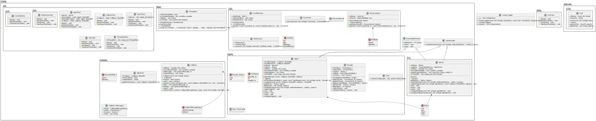

# Cmder2

This project is going to be an async/sync task executor implementation: user will be able to create an **agent** and ask it to execute a **task** (do some calculation). The **agent** checks the availability and capability of the **servers** being part of a serverpool, and selects the best one for the execution.

There are three layers involved:
* User level
* Agent level
* Server level
The communication way between the layers are done either in **synchronous** (blocking the caller) or in **asynchronous** way (don't block the result will be submitted later once it is available using a dedicated communication channel - a.k.a. "callback").

# Developer environment

Install:
* Docker
* Visual Studio Code & Extensions (recommended)
  * *Auto Header Plus* (v1.3.0)
  * *C/C++ Extension Pack* (v1.3.0) - The package incudes Intellisense that will help the C++ development.
  * *C/C++ Include Guard* (v1.7.1)
  * *C/C++ Themes* (v2.0.0)
  * *Docker* (v1.26)
  * *Git History* (v0.6.20)
  * *PlantUML* (v2.17.5)
  * *Remote Development* (v0.24.0) - The package inculdes the *Dev Containers* extension.

Start the docker service on your workstation. Clone this github repository and start VS Code. Press CTRL-SHIFT-p and search for *Dev container: New dev container* and/or *Dev container: Rebuild Container* (*Dev container: Clone repository in container volume...*). It will use the **devcontainer.json** and **Dockerfile** to build a new Arch Linux developer environment (or rebuild and existing one).

## Container

The container is defined in the **Dockerfile**.

More details [here](README_Docker.md).

## Build system

Bazel

# Class diagram

# POC

## Threadpool

## C++20 coroutines