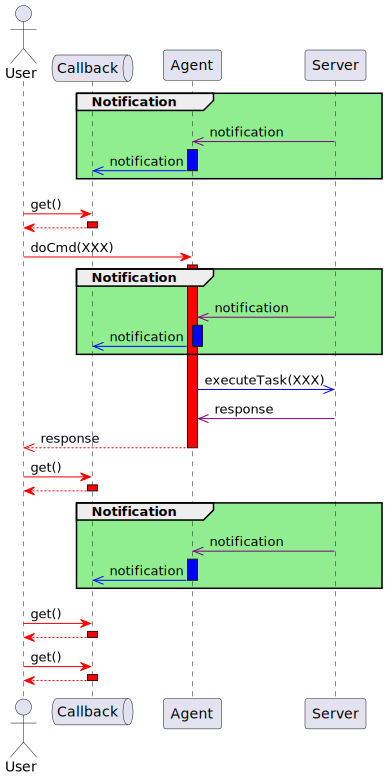
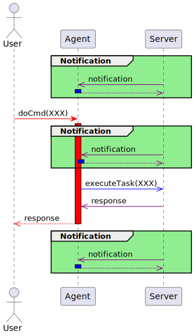

## Class diagram

Using hpp2plantuml. Installation:

**$ pip install hpp2plantuml**

Generate PlantUML:

**$ hpp2plantuml -i "*.hpp" -i ".\tests\*.hpp" -o .\diagrams\classdiagram.puml**

## Sequence diagrams

There are three basically different setups between the user and the agent:
* **Blocking the user's call with an active callback channel**: The caller thread is blocked and released once the result is to deliver. The notification channel is active the server's notifications are forwarded to the clients.
* **Blocking the user's call with an active callback channel**: The same as above, but the notifications are not forwarded to the client.
* **Async response**: In this case it is a MUST to have a callback registered. The caller thread returns immediately to the client, the only way to pass back the result is the callback's notification channel.

### Blocking the client's call with active notification channel

### Blocking the client's call without callback

### Async command execution
...